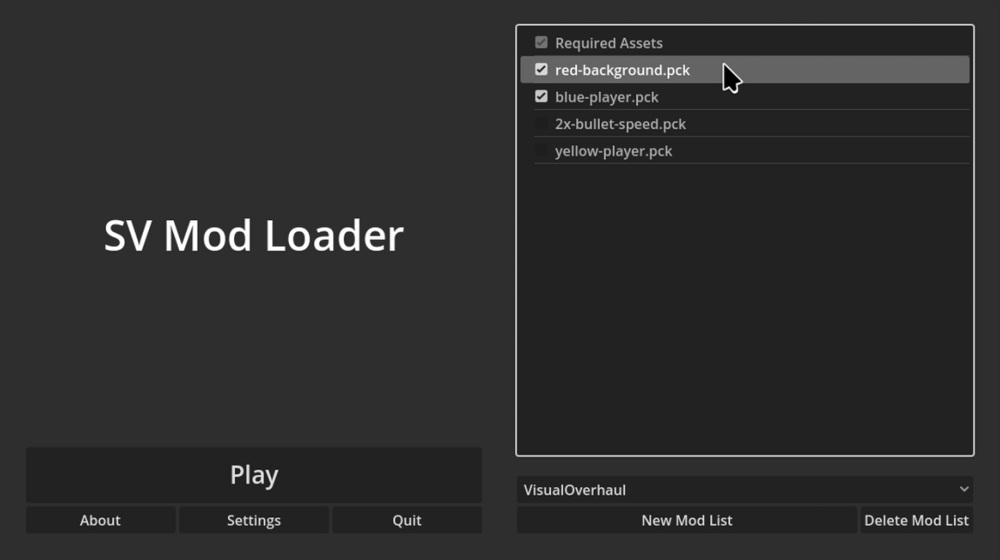

# SV Mod Loader
SV Mod Loader is an addon for the [Godot Engine](https://godotengine.org/)
that offers libraries and a pre-assembled launcher-style GUI for adding
mod support to your game. It supports mod lists, required and official
mods, checksum verification of official mods, and security warnings
when running untrusted mods.

SV Mod Loader is NOT a modding API. Its only purpose is to handle the
loading of [`.pck`](https://docs.godotengine.org/en/stable/tutorials/export/exporting_pcks.html)
files in a user-customisable way. When adding mod support to your game,
it is your responsibility to either document the structure of your
game, or simply make the source code available, so that modders know
how to structure their mod.

Note that an alternative, [godot-mod-loader](https://github.com/GodotModding/godot-mod-loader),
is probably more mature, stable, and feature-complete than SV Mod
Loader, and I would probably recommend using that instead in most
instances. The motivation behind SV Mod Loader was a specific use-case
involving distributing an asset pack separately from the game, which
would be required in order to start the game.

## Prerequisites
Requires Godot 4.5

To allow pop-up dialogs to show up deteched from the main window (instead of as
an embedded window), disable
[embed subwindows](https://docs.godotengine.org/en/stable/classes/class_projectsettings.html#class-projectsettings-property-display-window-subwindows-embed-subwindows)
in your project settings.

## Installation
Clone the repository and copy the `addons` folder into the same folder
as your `project.godot` file.

## Usage
Place an instance of the scene `ModLoaderUI` - found in `addons/sv_mod_loader/interface/mod_loader_ui.tscn` -
in the first scene of your game. The exported variables allow you to
configure the mod loader. The only required variable is "Play Scene",
which you should set to the scene you want to switch to when the user
hit the "Play" button.

## Example Game
An example game that uses the mod loader is located in the root
directory of this repo. Simply open `project.godot` in the Godot Engine
to start poking around.

The `Makefile` contains several commands that allow you to build and
install some example mods for this game. The source code of those mods
is located in the `example-mods` folder

## License
See the [`LICENSE`](./LICENSE) file.

